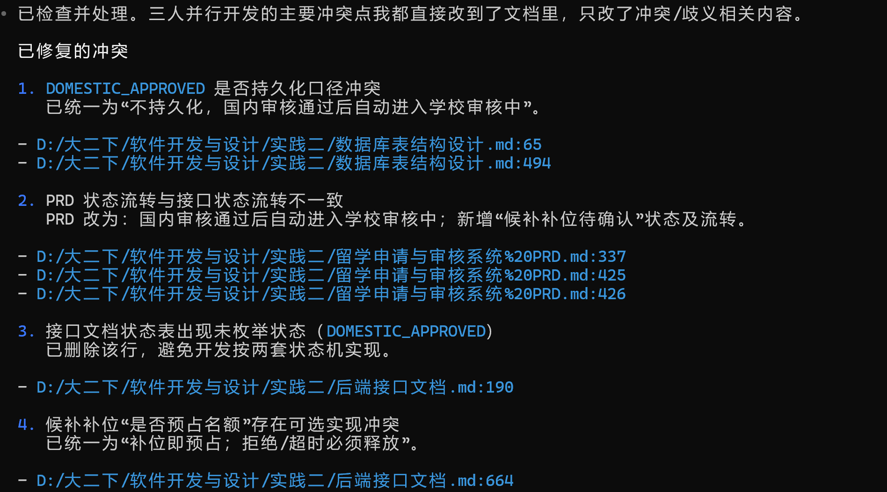

保留过程

> 说明：
> 本文档用于保留阶段性讨论、旧版判断和中间方案，允许包含历史口径。
> 若本文与当前实现不一致，以以下最新文档为准：
> 1. [留学申请与审核系统 PRD.md](D:/大二下/软件开发与设计/实践二/留学申请与审核系统 PRD.md:1)
> 2. [后端接口文档.md](D:/大二下/软件开发与设计/实践二/后端接口文档.md:1)
> 3. [数据库表结构设计.md](D:/大二下/软件开发与设计/实践二/数据库表结构设计.md:1)
> 4. [数据库与联调协作说明.md](D:/大二下/软件开发与设计/实践二/数据库与联调协作说明.md:1)
> 5. [一页式项目开工冻结页.md](D:/大二下/软件开发与设计/实践二/一页式项目开工冻结页.md:1)
> 6. [开发 ownership 表.md](D:/大二下/软件开发与设计/实践二/开发 ownership 表.md:1)
> 7. [前端页面与路由清单.md](D:/大二下/软件开发与设计/实践二/前端页面与路由清单.md:1)
> 8. [数据库协作规则（可执行版）.md](D:/大二下/软件开发与设计/实践二/数据库协作规则（可执行版）.md:1)
> 9. [模块验收清单.md](D:/大二下/软件开发与设计/实践二/模块验收清单.md:1)
>
> 特别说明：本文中出现的旧版接口文档版本号、`dashboard`、历史状态名、旧数据库口令或“当时未实现”的描述，仅代表当时阶段结论，不代表当前真实项目状态。

# 如果文档之间打架，到底听谁的


# 你看看我里面有没有必须改的问题，以及下一步我该做什么（只有这些文档现在）


可以，我直接按“**哪个文档 → 哪一块 → 改成什么 → 为什么改**”给你说。

------

## 1. 《后端接口文档(1).md》

## 改动位置

### “三、统一枚举”里的 **3.2 申请状态枚举**

你现在这里还写了：

```text
DOMESTIC_APPROVED             国内审核通过
```

## 改成什么

把这一行删掉，改成下面这版：

```text
DRAFT                         申请草稿
SUBMITTED                     已提交
DOMESTIC_REVIEWING            国内审核中
DOMESTIC_SUPPLEMENT           国内补充材料
DOMESTIC_REJECTED             国内审核不通过
SCHOOL_REVIEWING              学校审核中
WAITLISTED                    候补中
WAITLIST_PENDING_CONFIRM      候补补位待确认
RESERVED                      占位成功
ADJUSTMENT_SUGGESTED          建议调剂
SCHOOL_REJECTED               学校不通过
CANCELED                      已撤销
CLOSED                        已关闭
```

## 为什么改

因为你这份接口文档后面的“状态流转”已经写了：

+ 国内审核通过后，**直接进入 `SCHOOL_REVIEWING`**
+ 不再保留单独 assign 接口

而数据库设计文档也明确写了：

+ **没有单独保留 `DOMESTIC_APPROVED` 持久状态**，因为已经定成自动进入学校审核中。

也就是说：

+ 前面枚举里有 `DOMESTIC_APPROVED`
+ 后面流程里又不用它

这会让开发的人误以为这个状态还要落库、还要处理。
所以必须删掉，统一口径。

------

## 2. 《不冲突开发分工(2).md》

## 改动位置

### “四、你必须先做的东西”

里面的 **“2. 状态枚举（统一）”**

你现在这里还写了旧版状态：

```text
DRAFT
SUBMITTED
DOMESTIC_REVIEWING
DOMESTIC_APPROVED
DOMESTIC_SUPPLEMENT
DOMESTIC_REJECTED
SCHOOL_REVIEWING
RESERVED
WAITLISTED
ADJUST_SUGGESTED
SCHOOL_REJECTED
CANCELED
CLOSED
```

## 改成什么

改成和接口文档一致：

```text
DRAFT
SUBMITTED
DOMESTIC_REVIEWING
DOMESTIC_SUPPLEMENT
DOMESTIC_REJECTED
SCHOOL_REVIEWING
WAITLISTED
WAITLIST_PENDING_CONFIRM
RESERVED
ADJUSTMENT_SUGGESTED
SCHOOL_REJECTED
CANCELED
CLOSED
```

## 为什么改

这里有两个问题：

### 问题1：`DOMESTIC_APPROVED` 还在

这个和上面一样，要删掉，不然和接口文档、数据库设计冲突。

### 问题2：`ADJUST_SUGGESTED` 名字不一致

你接口文档里用的是：

```text
ADJUSTMENT_SUGGESTED
```

不是 `ADJUST_SUGGESTED`。

如果这个不统一，后面会出现：

+ 前端写一个状态名
+ 后端写另一个状态名
+ 数据库又是第三种

这类问题很恶心，而且 AI 最容易跟着旧文档乱写。

------

## 3. 《数据库表结构设计(1).md》

## 改动位置

### “八、一个小提醒”

里面现在写了：

> 第二，**文件表现在我没有单独建**。
> 如果没有，我建议再补一个 `files` 表。

## 改成什么

不要再写“建议”，直接定死。
改成：

```text
第二，文件存储方案统一如下：

- 开发阶段采用本地文件存储
- 数据库新增 `files` 表保存文件元数据
- `transcripts.file_id`、补件附件等统一关联 `files.id`
- 文件访问必须经过后端鉴权，不直接暴露真实存储路径
```

然后在 SQL 里新增一个 `files` 表，例如：

```sql
CREATE TABLE files (
  id BIGINT PRIMARY KEY AUTO_INCREMENT COMMENT '文件编号',
  file_key VARCHAR(100) NOT NULL COMMENT '文件唯一标识',
  original_name VARCHAR(255) NOT NULL COMMENT '原始文件名',
  storage_path VARCHAR(500) NOT NULL COMMENT '存储路径',
  file_type VARCHAR(50) NOT NULL COMMENT '文件类型',
  file_size BIGINT NOT NULL COMMENT '文件大小',
  business_type VARCHAR(50) NULL COMMENT '业务类型 transcript/attachment',
  uploaded_by BIGINT NULL COMMENT '上传人',
  created_at DATETIME NOT NULL DEFAULT CURRENT_TIMESTAMP,
  updated_at DATETIME NOT NULL DEFAULT CURRENT_TIMESTAMP ON UPDATE CURRENT_TIMESTAMP,
  UNIQUE KEY uk_file_key (file_key),
  CONSTRAINT fk_file_user FOREIGN KEY (uploaded_by) REFERENCES users(id)
) COMMENT='文件表';
```

## 为什么改

因为你现在 3 份文档对文件这件事还不够“落地一致”：

### 接口文档里已经有文件接口

+ 上传成绩单
+ 上传补件附件
+ 预览
+ 下载

### 技术路线文档也写了

+ 开发阶段本地文件存储
+ 数据库存 `fileId / filePath / fileMeta`

### 但数据库设计里却没真的建 `files` 表

只是写了“如果没有，我建议再补一个”。

这会导致后面三个人都不知道：

+ `fileId` 到底是什么
+ 是外部服务返回的？
+ 还是数据库里的？
+ `preview/download` 去查哪张表？

所以这里必须从“建议”改成“正式决定”。

------

## 4. 《技术路线说明（AI 协作开发版）.md》

## 改动位置

### “五、三人开发前必须冻结的技术路线规则”

里面的 **6. 公共目录冻结**

你现在写的是：

```text
modules/
  auth/
  users/
  batches/
  schools/
  majors/
  quotas/
  files/
  applications/
  domesticreviews/
  schoolreviews/
  waitlists/
  auditlogs/
  dashboard/
```

## 改成什么

你要和其他文档统一一套模块命名。
建议直接改成：

```text
modules/
  auth/
  users/
  batches/
  schools/
  majors/
  quotas/
  files/
  applications/
  domesticreviews/
  schoolreviews/
  waitlists/
  adjustments/
  auditlogs/
  dashboard/
```

并且在文档下面补一句：

```text
说明：代码目录统一使用不带短横线的 Java 包风格；
文档描述中如出现 domestic-reviews / school-reviews / audit-logs，仅表示业务模块名称，不表示实际包名。
```

## 为什么改

因为你其他文档里有时写：

+ `domestic-reviews`
+ `school-reviews`
+ `audit-logs`

技术路线文档里又写：

+ `domesticreviews`
+ `schoolreviews`
+ `auditlogs`

这会造成：

+ 文档里一套名字
+ 代码里另一套名字
+ AI 生成时又随机选一种

所以不是说哪种一定对，而是**必须只保留一种代码目录命名规则**。

------

## 5. 这三份文档首页都要补一条

## 改动位置

+ 《后端接口文档(1).md》开头
+ 《数据库表结构设计(1).md》开头
+ 《技术路线说明（AI 协作开发版）.md》开头

## 改成什么

在文档前面加一段：

```text
文档优先级说明：
1. 业务规则与产品边界以 PRD 为准
2. 接口设计与状态流转以后端接口文档为准
3. 数据落库结构以数据库设计文档为准
4. 若出现冲突，按以上顺序处理；个人理解和群聊口头描述不作为最终规则
```

## 为什么改

因为你“如何不冲突.md”里已经把这个规则写出来了：
PRD > 接口文档 > 数据库设计 > 群里补充规则。

但这个规则只在“如何不冲突”文档里，其他人如果只看接口文档或数据库设计文档，就不知道冲突时该听谁的。

所以要把它补进核心文档首页，防止后面扯皮。

------

## 6. 《留学申请与审核系统 PRD(3).md》

## 改动位置

### 不用大改正文，只要补一句“实现口径说明”

放在：

+ “8. 状态转换表”后面
+ 或 “16. 数据模型设计”前面

## 改成什么

加一句：

```text
实现口径说明：
为减少流程停顿与开发复杂度，系统实现时采用“国内审核通过后自动进入学校审核中”的方式，
因此代码与数据库层不单独保留持久停留的 DOMESTIC_APPROVED 状态。
```

## 为什么改

因为 PRD 原文里还是写了：

+ 国内审核通过
+ 再分配到学校审核池
+ 再进入学校审核中

而你现在的接口和数据库实现，已经收口成：

+ 直接进入 `SCHOOL_REVIEWING`。

PRD 不一定要大改，但最好补一句“实现口径说明”，这样老师/组员看 PRD 时不会以为你们漏做了一个状态。

------

## 你改完后会发生什么

改完这几处，最大的好处是：

## 1. 状态口径统一

不再出现：

+ PRD 一套
+ 分工文档一套
+ 接口文档一套
+ 数据库一套

## 2. 文件上传链路能落地

不然 A 做上传时会卡住。

## 3. AI 生成代码更稳定

因为 AI 最怕“文档里同一个东西有两个名字”。

## 4. 你后面更容易搭骨架

因为这些都是“开工前必须统一”的点。

------

## 最后帮你压缩成最短版

你现在就改这 5 件事：

1. **接口文档**：删掉 `DOMESTIC_APPROVED` 状态
2. **分工文档**：把状态枚举改成和接口文档一致，并把 `ADJUST_SUGGESTED` 改成 `ADJUSTMENT_SUGGESTED`
3. **数据库文档**：别再写“建议补 files 表”，直接正式新增 `files` 表
4. **技术路线文档**：统一模块目录命名，并说明“代码目录只用一种命名”
5. **三份核心文档首页**：都加“文档优先级说明”
6. **PRD**：补一句“实现口径说明”，说明不保留持久化 `DOMESTIC_APPROVED`

如果你愿意，我下一条可以直接把这 5 处的**可复制替换文本**完整写给你。

# 换窗口


# 解决文档间冲突

你看看三个人用这几个文档进行开发时还会有什么风险和冲突，告诉我并直接更改文档中冲突的内容（只改这个，其他不许动）



## 1️⃣ 统一状态（最重要）

你刚才已经改了一部分，还差确认：

👉 所有文档统一为：

+ ❌ 不存在 `DOMESTIC_APPROVED`
+ ✅ 国内通过 → 直接 `SCHOOL_REVIEWING`

------

## 2️⃣ 定死文件方案

👉 必须选一个（不要再写“建议”）：

推荐：

+ ✅ 新增 `files` 表
+ ✅ 所有 fileId 都来自数据库

------

## 3️⃣ 统一命名（防 AI 写错）

统一：

| 类型     | 规则                   |
| -------- | ---------------------- |
| 模块目录 | `domesticreviews`      |
| 状态枚举 | `ADJUSTMENT_SUGGESTED` |
| 表名     | snake_case             |
| Java字段 | camelCase              |

👉 不能出现：

+ domestic-reviews / domesticreviews 混用
+ ADJUST / ADJUSTMENT 混用

------

## 4️⃣ 冻结“文档优先级规则”

写进所有核心文档首页：

👉 PRD > 接口文档 > 数据库设计 > 个人理解

## 结果

  1. 状态统一
     已完成。三份核心文档中已去掉 DOMESTIC_APPROVED，并统一为“国内通过直接进入 SCHOOL_REVIEWING”。
  2. 文件方案定死
     已完成。已写成固定方案：

  - 必须有 files 表
  - 所有 fileId 必须来自 files.id
    并去掉“或后续补 files 表”这种分支写法。

  3. 命名统一
     已完成。

  - domestic-reviews 全部改为 domesticreviews
  - 增加命名冻结规则表，明确：模块目录 domesticreviews、状态枚举 ADJUSTMENT_SUGGESTED、表名 snake_case、Java 字段
    camelCase。

  4. 冻结优先级规则
     已完成。三份核心文档首页都写入：
     PRD > 接口文档 > 数据库设计 > 个人理解

  已修改文件：

  - D:/大二下/软件开发与设计/实践二/留学申请与审核系统%20PRD.md
  - D:/大二下/软件开发与设计/实践二/后端接口文档.md
  - D:/大二下/软件开发与设计/实践二/数据库表结构设计.md

# 建立项目骨架

能跑起来的最小系统：启动能力、基础依赖、基础规则、目录结构

## 提示词

你是一个资深 Java 后端工程师。

请帮我初始化一个 Spring Boot 3.x 单体项目骨架，用于“留学申请与审核系统”。

【目标】
先只做“项目骨架初始化”，不要写具体业务逻辑。
要求项目可以直接启动，并提供一个测试接口用于验证工程可运行。

【技术栈要求】
- Java 17
- Spring Boot 3.x
- Maven
- Spring Web
- Spring Validation
- Spring Security（先做基础配置，放行测试接口）
- MyBatis-Plus
- Lombok
- MySQL Driver

【项目包名】
com.example.admissionsystem

【项目定位】
这是一个后台管理系统后端，采用单体架构。
后续会包含：
- auth
- users
- applications
- domesticreviews
- schoolreviews
- waitlists
- quotas
- batches
- schools
- majors
- files
- auditlogs
- dashboard
但这一步不要写业务实现，只搭骨架。

【必须生成的内容】
1. Maven pom.xml
2. Spring Boot 启动类 Application.java
3. application.yml
4. 统一返回结构 Result<T>
5. 一个测试接口：
   GET /api/health
   返回：
   {
     "code": 0,
     "message": "success",
     "data": "ok"
   }

【目录结构要求】
src/main/java/com/example/admissionsystem/
  common/
    response/
    exception/
    util/
  config/
  auth/
    controller/
    service/
  users/
    controller/
    service/
  batches/
  schools/
  majors/
  quotas/
  files/
  applications/
  domesticreviews/
  schoolreviews/
  waitlists/
  adjustments/
  auditlogs/
  dashboard/

【具体要求】
- controller 层只返回测试结果，不写业务
- 先不要写数据库表、SQL、mapper、entity
- 先不要写 JWT 逻辑，只预留安全配置
- Spring Security 先放行 /api/health
- application.yml 中保留 MySQL 配置占位
- MyBatis-Plus 做基础配置即可
- Result<T> 要有 success(data)、success()、fail(message) 静态方法

【验收标准】
- 项目能启动
- 访问 GET /api/health 返回统一结构 JSON
- 目录结构符合要求
- 代码清晰、可扩展

## 结果

  已按要求完成：

  - Java 17 / Spring Boot 3.x / Maven
  - 引入 Web、Validation、Security、MyBatis-Plus、Lombok、MySQL Driver
  - 安全配置放行 /api/health
  - 统一返回结构 Result<T>（含 success(data)、success()、fail(message)）
  - 目录骨架按你给的模块创建（空目录用 .gitkeep 保留）
  - 未添加业务逻辑、未加 JWT、未写 mapper/entity/sql

  验收结果：

  - mvn -DskipTests package：成功
  - 实际启动并请求 GET /api/health 返回：

  {"code":0,"message":"success","data":"ok"}

## 统一返回结构

后端和前端的“通信协议

## 配置文件

不改代码也能改系统

端口 数据库连接 日志级别 JWT/安全

# 进度1

1. **你已经做成了什么**
2. **你还差什么**
3. **每一项对应给 Codex 的提示词**

------

## 你现在已经做成了什么

结合你刚才的验收结果和现有文档，你已经完成了**第一阶段：最小可运行后端骨架**。

## 已完成 1：项目能启动

你已经把 Spring Boot 3.x 单体项目骨架搭起来了，`mvn -DskipTests package` 成功，应用能实际启动，并且 `GET /api/health` 能返回统一结构 JSON。这个说明：

+ Maven 依赖是通的
+ Spring Boot 配置没问题
+ Web 层可用
+ 基础 Security 放行生效
+ 统一返回结构可用

## 已完成 2：基础技术栈已经落地

你已经按技术路线把后端技术栈定死了：

+ Java 17
+ Spring Boot 3.x
+ Spring Web
+ Validation
+ Spring Security
+ MyBatis-Plus
+ Lombok
+ MySQL Driver
+ Maven
  这和你冻结的技术路线一致。

## 已完成 3：目录骨架已经搭好

你已经把模块目录建出来了，后续就是往里填：

+ auth
+ users
+ applications
+ domesticreviews
+ schoolreviews
+ waitlists
+ quotas
+ batches
+ schools
+ majors
+ files
+ auditlogs
+ dashboard
  这一步很重要，因为它把后面三个人的落点固定住了。

## 已完成 4：统一返回协议已经落地

你已经有 `Result<T>`，而且有：

+ `success(data)`
+ `success()`
+ `fail(message)`
  这和接口文档里统一的 `code / message / data` 保持一致。

## 已完成 5：文档层面已经基本统一

你已经把最容易炸的几个冲突点收口了：

+ 不保留 `DOMESTIC_APPROVED` 持久状态
+ 国内审核通过直接进 `SCHOOL_REVIEWING`
+ 候补先进入 `WAITLIST_PENDING_CONFIRM`
+ 接受调剂后原申请关闭，新申请重开
+ 文件方案定成 `files` 表
+ 模块命名统一成 `domesticreviews` 这套风格

------

## 你现在还差什么

你现在缺的不是“更多设计”，而是**把文档冻结内容落成可开发的代码底座**。

## 还差 1：数据库真正落地

虽然数据库设计已经写好了，但你还没真正做到：

+ 建库
+ 建表
+ 跑 SQL
+ 初始化基础数据
  而技术路线已经明确把这件事列为开工前必须完成项。

## 还差 2：登录 / 当前用户最小闭环

你现在 health 通了，但业务协作真正需要的是：

+ `POST /api/auth/login`
+ `GET /api/auth/me`
  这是 A、B 开始联调前必须有的。接口文档和开发顺序都写了你先做登录和权限。

## 还差 3：状态枚举和状态机代码

文档里已经冻结了状态枚举和状态流转，但代码里还没真正落地。
而且文档明确规定：

+ `application.status` 不能被别人直接改
+ 所有状态流转只能走业务接口
+ A/B 不能自己写状态判断核心逻辑

## 还差 4：核心接口空壳

你还没把别人依赖的接口骨架先放出来。至少要有这些空壳：

+ auth
+ applications 核心状态接口
+ domesticreviews 基础接口
+ school-reviews submit
+ files 上传接口
  因为接口先行是你们的硬规则。

## 还差 5：文件上传骨架

文档已经把文件方案定死：

+ 本地存储
+ `files` 表
+ `fileId` 统一来自 `files.id`
+ 访问必须鉴权
  但现在还没有实际代码骨架。A 后面会被这里卡住。

## 还差 6：测试账号和初始化数据

技术路线明确说了，A/B 开工前你要准备好：

+ 测试账号
+ 批次
+ 学校
+ 专业
+ 配额基础数据

------

## 现在最正确的开发顺序

按你文档里的冻结顺序，建议你现在这样推进：

1. **数据库 + 初始化数据**
2. **auth/login + auth/me**
3. **状态枚举 + 状态机入口**
4. **核心接口空壳**
5. **文件上传骨架**
6. **再让 A、B 开工**

------

# 下一步给 Codex 的提示词

下面这些你可以直接分任务丢给 Codex。
我按“一个提示词做一件事”给你，方便你拆 PR。

------

## 提示词 1：数据库建表与初始化

```text
你是一个资深 Java 后端工程师，请基于我当前的 Spring Boot 3.x 单体项目，为“留学申请与审核系统”完成数据库初始化准备工作。

【目标】
只做数据库层初始化，不写业务逻辑，不写复杂 service。
请输出：
1. application.yml 中可用的 MySQL 连接配置占位
2. schema.sql（建表 SQL）
3. data.sql（初始化测试数据）

【技术栈】
- Java 17
- Spring Boot 3.x
- Maven
- MySQL 8
- MyBatis-Plus

【项目包名】
com.example.admissionsystem

【要求】
严格按以下业务约束生成：
- 不保留 DOMESTIC_APPROVED 持久状态
- application 当前状态统一使用：
  DRAFT
  SUBMITTED
  DOMESTIC_REVIEWING
  DOMESTIC_SUPPLEMENT
  DOMESTIC_REJECTED
  SCHOOL_REVIEWING
  WAITLISTED
  WAITLIST_PENDING_CONFIRM
  RESERVED
  ADJUSTMENT_SUGGESTED
  SCHOOL_REJECTED
  CANCELED
  CLOSED
- 必须包含 files 表
- 所有 fileId 统一来自 files.id
- 表名使用 snake_case
- Java 字段未来按 camelCase 对应

【必须生成的表】
users
admission_batches
schools
majors
school_quotas
major_quotas
files
students
transcripts
personal_statements
applications
rule_snapshots
domestic_reviews
school_reviews
waitlist_records
application_status_histories
audit_logs

【初始化数据要求】
data.sql 至少插入：
- 1 个 ADMIN
- 1 个 AGENT
- 1 个 DOMESTIC_REVIEWER
- 1 个 SCHOOL_REVIEWER
- 1 个 admission_batch
- 1 所学校
- 2 个专业
- 对应 school_quotas / major_quotas

【注意】
- 先不要生成 mapper / entity / service
- 只产出数据库初始化需要的内容
- SQL 要尽量可直接执行
- users.password_hash 可先写占位字符串
```

已完成数据库初始化准备，改了这 3 个文件：

  - /D:/大二下/软件开发与设计/实践二/admission-system-backend/src/main/resources/application.yml
  - /D:/大二下/软件开发与设计/实践二/admission-system-backend/src/main/resources/schema.sql
  - /D:/大二下/软件开发与设计/实践二/admission-system-backend/src/main/resources/data.sql

  这次只做了数据库层内容，没有生成 mapper / entity / service。schema.sql 已包含你要求的 17 张表，保留了 files 表，
  并统一让 transcripts.file_id -> files.id；applications.current_status 只使用你冻结的那 13 个状态，没有
  DOMESTIC_APPROVED。data.sql 也已经放入最小联调用数据：4 个用户角色、1 个批次、1 所学校、2 个专业，以及对应学校/
  专业配额。

  application.yml 里我补了可直接用的 MySQL 连接占位和 Spring SQL 初始化配置，启动时会加载 schema.sql 和 data.sql。
  当前我做的是静态检查，还没有真的连本地 MySQL 执行；另外你终端里看到的 SQL 中文注释如果有乱码，是 PowerShell 输出
  编码问题，文件本身已按 UTF-8 写入。若你要，我下一步可以继续接 auth/login 和 auth/me 的最小闭环。

## 提示词 2：登录与当前用户接口最小闭环

```text
你是一个资深 Spring Boot 后端工程师，请基于我已经完成的项目骨架，为“留学申请与审核系统”实现最小认证闭环。

【目标】
只实现最小可运行认证接口，不接 JWT，不接数据库真实查询，可以先用内存假数据或固定账号返回，目的是让前后端能联调。

【需要实现】
1. POST /api/auth/login
2. GET /api/auth/me

【统一返回格式】
使用现有 Result<T>：
- success(data)
- success()
- fail(message)

【角色枚举】
AGENT
DOMESTIC_REVIEWER
SCHOOL_REVIEWER
ADMIN

【login 返回结构示例】
{
  "code": 0,
  "message": "success",
  "data": {
    "token": "mock-token",
    "userId": 1,
    "username": "admin",
    "role": "ADMIN",
    "schoolCode": null,
    "mustChangePassword": false
  }
}

【实现要求】
- 新建 auth/controller/AuthController
- 新建 auth/service/AuthService
- 新建对应 dto / vo（若你认为有必要）
- Security 先继续放行 /api/auth/login 和 /api/health
- /api/auth/me 可以通过固定 mock 用户返回
- 代码结构清晰，便于未来替换成 JWT + 数据库版
- 不写真实密码加密逻辑
- 不写 JWT 签发逻辑
- 不写复杂异常体系，只保证接口可跑通
```

已实现最小认证闭环，并通过了 mvn -DskipTests package 编译验证。

  新增了 /D:/大二下/软件开发与设计/实践二/admission-system-backend/src/main/java/com/example/admissionsystem/auth/
  controller/AuthController.java、/D:/大二下/软件开发与设计/实践二/admission-system-backend/src/main/java/com/
  example/admissionsystem/auth/service/AuthService.java、/D:/大二下/软件开发与设计/实践二/admission-system-
  backend/src/main/java/com/example/admissionsystem/auth/dto/LoginRequest.java、/D:/大二下/软件开发与设计/实践二/
  admission-system-backend/src/main/java/com/example/admissionsystem/auth/vo/AuthUserVO.java 和 /D:/大二下/软件开
  发与设计/实践二/admission-system-backend/src/main/java/com/example/admissionsystem/auth/model/UserRole.java。实
  现方式是内存 mock 用户表，支持 POST /api/auth/login 和 GET /api/auth/me，返回结构走你现有的 Result<T>，不接数据
  库、不做 JWT 签发。

  同时我改了 /D:/大二下/软件开发与设计/实践二/admission-system-backend/src/main/java/com/example/admissionsystem/
  config/SecurityConfig.java，放行了 /api/health、/api/auth/login、/api/auth/me，这样前后端可以直接联调。当前内置
  了 4 个 mock 账号：admin/admin123、agent01/agent123、domestic01/domestic123、school_usyd_01/school123。如果你继
  续往下推，下一步最合适的是把状态枚举和状态流转校验骨架补进去。

## 提示词 3：状态枚举与状态机入口

```text
你是一个资深 Java 后端架构师，请基于当前 Spring Boot 项目，为“留学申请与审核系统”实现状态枚举和状态机入口骨架。

【目标】
不写完整业务，不连数据库，只先把状态统一定义和状态流转校验入口搭出来，后续所有状态变更都要走这里。

【状态枚举】
DRAFT
SUBMITTED
DOMESTIC_REVIEWING
DOMESTIC_SUPPLEMENT
DOMESTIC_REJECTED
SCHOOL_REVIEWING
WAITLISTED
WAITLIST_PENDING_CONFIRM
RESERVED
ADJUSTMENT_SUGGESTED
SCHOOL_REJECTED
CANCELED
CLOSED

【流转规则】
DRAFT -> SUBMITTED
SUBMITTED -> DOMESTIC_REVIEWING
DOMESTIC_REVIEWING -> SCHOOL_REVIEWING
DOMESTIC_REVIEWING -> DOMESTIC_SUPPLEMENT
DOMESTIC_REVIEWING -> DOMESTIC_REJECTED
DOMESTIC_SUPPLEMENT -> SUBMITTED
SCHOOL_REVIEWING -> RESERVED
SCHOOL_REVIEWING -> ADJUSTMENT_SUGGESTED
SCHOOL_REVIEWING -> WAITLISTED
SCHOOL_REVIEWING -> SCHOOL_REJECTED
WAITLISTED -> WAITLIST_PENDING_CONFIRM
WAITLIST_PENDING_CONFIRM -> RESERVED
WAITLIST_PENDING_CONFIRM -> CLOSED
ADJUSTMENT_SUGGESTED -> CLOSED
SUBMITTED -> CANCELED
SCHOOL_REVIEWING -> CANCELED
WAITLISTED -> CANCELED
RESERVED -> CLOSED
DOMESTIC_REJECTED -> CLOSED
SCHOOL_REJECTED -> CLOSED
CANCELED -> CLOSED

【要求】
请生成：
1. ApplicationStatus 枚举
2. 一个状态流转校验类，例如 ApplicationStatusFlowValidator
3. 一个公共异常，例如 InvalidStatusTransitionException
4. 一个示例 service 方法，例如 assertCanTransfer(from, to)

【注意】
- 不要写数据库
- 不要写 controller
- 不要写完整业务
- 重点是把“状态只能按规则流转”的基础能力先落地
- 代码尽量简洁、可维护
```

  新增了这 4 个核心文件：

  - /D:/大二下/软件开发与设计/实践二/admission-system-backend/src/main/java/com/example/admissionsystem/
    applications/model/ApplicationStatus.java
  - /D:/大二下/软件开发与设计/实践二/admission-system-backend/src/main/java/com/example/admissionsystem/
    applications/service/ApplicationStatusFlowValidator.java
  - /D:/大二下/软件开发与设计/实践二/admission-system-backend/src/main/java/com/example/admissionsystem/common/
    exception/InvalidStatusTransitionException.java
  - /D:/大二下/软件开发与设计/实践二/admission-system-backend/src/main/java/com/example/admissionsystem/
    applications/service/ApplicationStatusService.java

  实现方式是：
  ApplicationStatus 统一承载你冻结的 13 个状态；
  ApplicationStatusFlowValidator 用 EnumMap + EnumSet 显式定义允许流转；
  assertCanTransfer(from, to) 负责统一拦截非法状态变更；
  InvalidStatusTransitionException 作为后续业务层共用异常；
  ApplicationStatusService 提供一个最小 service 入口，后面 application / domesticreview / schoolreview / waitlist
  的状态修改都可以先从这里进。

  这一步没有接数据库、没有写 controller、没有掺业务逻辑，目的是把“状态不能随便跳”的基础约束先固定住。下一步最顺手
  的是补核心命令接口空壳，把这些接口统一挂到后续状态机入口上。

## 提示词 4：核心接口空壳

```text
你是一个资深 Spring Boot 工程师，请基于当前项目骨架，为“留学申请与审核系统”补齐核心接口空壳，但不要实现真实业务逻辑。

【目标】
给三人并行开发提供稳定接口入口。现在只需要 controller + service 空壳，让接口可访问、返回统一结构即可。

【要生成的接口】
1. POST /api/applications/{id}/submit
2. POST /api/applications/{id}/cancel
3. POST /api/applications/{id}/waitlist-confirm
4. POST /api/applications/{id}/accept-adjustment
5. POST /api/applications/{id}/reject-adjustment
6. POST /api/applications/{id}/close
7. POST /api/domesticreviews/{id}/claim
8. POST /api/domesticreviews/{id}/submit
9. POST /api/school-reviews/{id}/submit

【要求】
- 每个接口都返回 Result.success("ok") 或有意义的占位响应
- 创建 applications/controller/ApplicationCommandController
- 创建 domesticreviews/controller/DomesticReviewController
- 创建 schoolreviews/controller/SchoolReviewController
- service 也建出来，但先只写占位逻辑
- 参数对象可按接口动作简单建 request dto
- 不接数据库
- 不写复杂校验
- 代码结构要为后续填充真实业务留好位置

【额外要求】
请在代码注释里明确标注：
- application.status 不允许被外部直接修改
- 后续状态变更必须调用状态机校验入口
```

核心接口空壳已经补齐，并通过了 mvn -DskipTests package 编译。

  新增了 3 个控制器：
  /D:/大二下/软件开发与设计/实践二/admission-system-backend/src/
  main/java/com/example/admissionsystem/applications/controller/
  ApplicationCommandController.java、
  /D:/大二下/软件开发与设计/实践二/admission-system-backend/src/
  main/java/com/example/admissionsystem/domesticreviews/controller/
  DomesticReviewController.java、
  /D:/大二下/软件开发与设计/实践二/admission-system-backend/src/
  main/java/com/example/admissionsystem/schoolreviews/controller/
  SchoolReviewController.java。

  同时补了对应 service 和最小请求对象，当前接口都能访问并返回
  Result.success("ok")：
  /api/applications/{id}/submit、
  /cancel、
  /waitlist-confirm、
  /accept-adjustment、
  /reject-adjustment、
  /close、
  /api/domesticreviews/{id}/claim、
  /submit、
  /api/school-reviews/{id}/submit。

  我在 service 里按你的要求加了明确注释：
  application.status 不允许被外部直接修改，后续真实状态变更必须先调
  用状态机校验入口。现在这层就是稳定接口骨架，后面你们可以分别往里填
  业务，不需要再改路由和基础返回结构。下一步最顺手的是补文件上传骨
  架。

## 提示词 5：文件上传骨架

```text
你是一个资深 Spring Boot 后端工程师，请基于当前项目骨架，为“留学申请与审核系统”实现文件模块的最小可运行骨架。

【目标】
只做开发阶段本地文件存储骨架，不接数据库真实持久化，但代码结构要为未来 files 表接入做好准备。

【接口】
1. POST /api/files/transcripts
2. POST /api/files/attachments
3. GET /api/files/{fileId}/preview
4. GET /api/files/{fileId}/download

【约束】
- 开发阶段采用本地文件存储
- 未来 fileId 对应 files.id
- 文件访问必须经过后端，不直接暴露真实存储路径
- 先不做复杂权限
- 先不接数据库
- 先不做真实预览转换

【要求】
请生成：
- files/controller/FileController
- files/service/FileService
- 上传返回对象 FileUploadResponse，至少包含 fileId、originalName、fileType、fileSize
- 本地存储目录配置项，例如 app.file.base-dir
- 预览和下载先按基础文件读取返回
- 代码清晰，后续容易接 files 表

【注意】
- 只做骨架和最小可运行能力
- 不写业务耦合代码
- 不要把文件路径直接暴露给前端
```

文件模块最小骨架已经完成，并通过了 mvn -DskipTests package 编译。

  新增了 /D:/大二下/软件开发与设计/实践二/admission-system-backend/
  src/main/java/com/example/admissionsystem/files/controller/
  FileController.java、/D:/大二下/软件开发与设计/实践二/admission-
  system-backend/src/main/java/com/example/admissionsystem/files/
  service/FileService.java、/D:/大二下/软件开发与设计/实践二/
  admission-system-backend/src/main/java/com/example/
  admissionsystem/files/vo/FileUploadResponse.java，并在 /D:/大二下/
  软件开发与设计/实践二/admission-system-backend/src/main/resources/
  application.yml 里加了 app.file.base-dir: ./storage/files，在 /D:/
  大二下/软件开发与设计/实践二/admission-system-backend/src/main/
  java/com/example/admissionsystem/config/SecurityConfig.java 里放行
  了 /api/files/**。

  当前实现是开发阶段本地文件存储骨架：
  POST /api/files/transcripts 和 POST /api/files/attachments 会把文
  件写到本地目录，并返回 fileId / originalName / fileType /
  fileSize；
  GET /api/files/{fileId}/preview 和 /download 都通过后端读取文件返
  回，不暴露真实路径。元数据目前放在内存 ConcurrentHashMap 里，
  fileId 用递增 Long 模拟，后面替换成 files 表时不需要改接口形状，只
  需要把存取逻辑切到数据库。

## 提示词 6：初始化测试账号与基础数据脚本

```text
你是一个资深后端工程师，请为“留学申请与审核系统”生成一份可直接用于本地联调的初始化测试数据方案。

【目标】
基于已有数据库设计，生成一份 data.sql 或等价初始化脚本，方便前后端联调。

【至少要有】
- ADMIN 账号 1 个
- AGENT 账号 1 个
- DOMESTIC_REVIEWER 账号 1 个
- SCHOOL_REVIEWER 账号 1 个
- 一个进行中的批次
- 一个学校（例如 USYD）
- 两个专业（例如 SE、IR）
- 对应学校配额和专业配额

【要求】
- 所有状态、角色名与现有文档一致
- SCHOOL_REVIEWER 需要绑定 school_code
- school_quotas 与 major_quotas 数据要匹配
- 插入顺序要满足外键依赖
- 用户密码可先使用固定占位 hash
- 输出要尽量可直接执行
```

已经把本地联调用的初始化测试数据方案落到 /D:/大二下/软件开发与设
  计/实践二/admission-system-backend/src/main/resources/data.sql
  里，并验证过 mvn -DskipTests package 可以正常打包。

  现在这份数据不只是最小配置数据，还包含了一条可联调的业务样例：

  - 4 个账号：ADMIN、AGENT、DOMESTIC_REVIEWER、SCHOOL_REVIEWER
  - 1 个进行中的批次：2026秋季批次
  - 1 所学校：USYD
  - 2 个专业：SE、IR
  - 对应学校配额和专业配额，数量一致可对上
  - 1 条样例文件记录
  - 1 个学生
  - 1 条成绩单
  - 1 份自荐材料
  - 1 条草稿申请 DRAFT

  其中 SCHOOL_REVIEWER 已绑定 school_code = 'USYD'，插入顺序按外键依
  赖排好了，密码先用固定占位值，比如：
  admin / {noop}admin123
  agent01 / {noop}agent123
  domestic01 / {noop}domestic123
  school_usyd_01 / {noop}school123

  如果你下一步要继续，我建议直接做两件事之一：

  1. 补一个全局异常处理，把 IllegalArgumentException 和状态异常统一
     转成 Result.fail(...)
  2. 开始接真正的申请草稿创建/编辑接口，把现在这套骨架接到数据库上

### 你现在最该先丢给 Codex 的顺序

按优先级排：

1. **提示词 1：数据库建表与初始化**
2. **提示词 2：login / me**
3. **提示词 3：状态枚举与状态机**
4. **提示词 4：核心接口空壳**
5. **提示词 5：文件上传骨架**
6. **提示词 6：初始化测试数据**

------

### 你现在的阶段一句话总结

你已经做成了：

**“能启动的后端骨架 + 文档基本冻结”**

你还差的是：

**“数据库、认证闭环、状态机、核心接口空壳、文件骨架”**

这几项做完，你就可以正式让另外两个人接进来。

下一条我可以直接继续帮你出：

**“你自己今天该先做哪两个 Codex 提示词，为什么”**，我会按你现在最省时间的顺序排。

# 完善

可以，下面只给你**必须做**的 3 个提示词，按优先级排好。

------

## 1）全局异常处理（必须先做）

```text
你是一个资深 Spring Boot 3 后端工程师，请基于我当前已经完成的项目骨架，为“留学申请与审核系统”补一个全局异常处理机制。

【当前项目情况】
- Java 17
- Spring Boot 3.x
- Maven
- 已有统一返回结构 Result<T>
- 已有状态异常类：
  com.example.admissionsystem.common.exception.InvalidStatusTransitionException
- 已有最小认证闭环
- 已有核心命令接口空壳
- 已有状态流转校验骨架

【目标】
实现统一异常返回，保证所有接口始终返回：
{
  "code": ...,
  "message": "...",
  "data": null
}

【必须处理的异常】
1. InvalidStatusTransitionException
2. IllegalArgumentException
3. MethodArgumentNotValidException
4. BindException
5. Exception（兜底）

【要求】
- 新建全局异常处理类，例如：
  com.example.admissionsystem.common.exception.GlobalExceptionHandler
- 使用 @RestControllerAdvice
- 所有异常都返回 Result.fail(message) 或等价统一失败结构
- 对参数校验异常，要把最关键的错误信息提取出来返回，不要返回整段默认异常栈
- 对兜底异常，返回一个通用错误信息，例如“系统异常，请稍后重试”
- 不要打印巨量无用日志，但要保留基本错误日志
- 不改现有接口路径
- 不改现有 Result<T> 的方法签名，除非绝对必要
- 代码要可直接编译运行

【额外要求】
请顺手检查当前 controller 中如果存在直接抛 RuntimeException、IllegalArgumentException 的地方，确保最终都会被统一异常处理接住。
```

 全局异常处理已经补上，并且项目可以直接编译运行。

  新增文件是 /D:/大二下/软件开发与设计/实践二/admission-system-
  backend/src/main/java/com/example/admissionsystem/common/
  exception/GlobalExceptionHandler.java。它用了
  @RestControllerAdvice，统一把异常收敛成你要求的结构：

  {
    "code": 1,
    "message": "...",
    "data": null
  }

  当前已覆盖：

  - InvalidStatusTransitionException
  - IllegalArgumentException
  - MethodArgumentNotValidException
  - BindException
  - Exception 兜底，返回 系统异常，请稍后重试

  参数校验异常只提取最关键的一条错误信息，不会把默认长异常栈直接返回
  给前端；日志也做了分级处理：
  业务/参数类异常记 warn，兜底异常记 error，避免刷一堆无意义日志。

  我顺手检查了当前代码里直接抛异常的地方，现状是：

  - ApplicationStatusFlowValidator 抛
    InvalidStatusTransitionException
  - FileService 抛 IllegalArgumentException
  - FileService 抛 UncheckedIOException

  这些现在都会被统一接住：
  前两类分别命中专门处理器，UncheckedIOException 会落到 Exception 兜
  底处理器里，不会再把默认白页或原始异常直接暴露给前端。

  另外我已经验证过 mvn -DskipTests package 通过。下一步如果继续往下
  做，最合适的是把申请草稿创建/编辑接口真正接到数据库。

## 2）真实数据库落地校验（必须做）

```text
你是一个资深 Java 后端工程师，请基于我当前的 Spring Boot 3.x 项目，把“留学申请与审核系统”的数据库底座真正落地。

【当前情况】
- 项目骨架已完成
- 已有 application.yml 基础配置
- 已有 data.sql
- 目前 auth 还是 mock，files 元数据还是内存结构
- 目标是先把 MySQL 底座跑通，不要求立刻把所有业务都接数据库

【目标】
请完成并整理以下内容：
1. application.yml 中可用的 MySQL 连接配置
2. schema.sql
3. data.sql
4. 项目启动时可真实连库、真实建表、真实导入初始化数据

【技术要求】
- Java 17
- Spring Boot 3.x
- MySQL 8
- MyBatis-Plus
- Maven

【表要求】
必须包含这些表：
users
admission_batches
schools
majors
school_quotas
major_quotas
files
students
transcripts
personal_statements
applications
rule_snapshots
domestic_reviews
school_reviews
waitlist_records
application_status_histories
audit_logs

【业务约束】
- 不保留 DOMESTIC_APPROVED 持久状态
- files 表必须存在
- 表名使用 snake_case
- 状态枚举与我现有文档一致
- school_reviewer 必须能绑定 school_code
- 初始化数据至少包含：
  ADMIN / AGENT / DOMESTIC_REVIEWER / SCHOOL_REVIEWER
  1 个进行中批次
  1 所学校 USYD
  2 个专业 SE、IR
  对应 school_quotas / major_quotas
  1 条样例学生、成绩单、自荐材料、草稿申请

【要求】
- 优先使用 Spring Boot 标准方式加载 schema.sql / data.sql
- 如果需要，补充 spring.sql.init 相关配置
- 保证外键顺序正确
- 生成内容要尽量可以直接运行
- 不要求把 auth、files、applications 立刻全部改成数据库实现
- 这一步的核心是“库真的连上、表真的建了、样例数据真的进去了”

【最终输出要求】
请明确告诉我：
- 改了哪些配置文件
- 新增了哪些 SQL 文件
- 启动后应该如何验证数据库真的落地成功
```

• 数据库底座已经整理到可真实初始化的状态，当前唯一阻塞项不是代码，而
  是 MySQL 账号密码。

  我改了什么

  改了这些配置文件：

  - /D:/大二下/软件开发与设计/实践二/admission-system-backend/src/
    main/resources/application.yml
      - 保留并补全了 spring.datasource.*
      - 使用 Spring Boot 标准 spring.sql.init.* 加载 schema.sql /
        data.sql
      - 新增了 continue-on-error: false，启动时脚本出错会直接失败，
        便于发现问题
  - /D:/大二下/软件开发与设计/实践二/admission-system-backend/
    pom.xml
      - 增加了 start-class，避免运行时主类解析不稳定

  新增/重写了这些 SQL 文件：

  - /D:/大二下/软件开发与设计/实践二/admission-system-backend/src/
    main/resources/schema.sql
      - 17 张表全部在内
      - snake_case 表名
      - 保留 files 表
      - 不保留 DOMESTIC_APPROVED 持久状态
      - school_reviewer 可通过 users.school_code 绑定学校
  - /D:/大二下/软件开发与设计/实践二/admission-system-backend/src/
    main/resources/data.sql
      - 4 个角色账号：ADMIN / AGENT / DOMESTIC_REVIEWER /
        SCHOOL_REVIEWER
      - 1 个进行中批次
      - 1 所学校 USYD
      - 2 个专业 SE / IR
      - 对应 school_quotas / major_quotas
      - 1 条样例文件、学生、成绩单、自荐材料、草稿申请

  我实际验证到哪一步

  我已经验证了：

  - 3306 端口在监听，说明本机 MySQL 服务是开着的
  - mvn -DskipTests package 成功
  - java -jar target\admission-system-backend-0.0.1-SNAPSHOT.jar 能
    启动到数据源初始化阶段
  - Spring Boot 已经开始执行 schema.sql / data.sql

  当前失败点是：

  - MySQL 认证失败：Access denied for user 'root'@'localhost' (using
    password: YES)

  这说明：
  不是脚本没挂上，也不是 Spring Boot 没走初始化；
  而是当前 /D:/大二下/软件开发与设计/实践二/admission-system-
  backend/src/main/resources/application.yml 里的账号密码和你本机
  MySQL 实际账号密码不匹配。

  启动后如何验证数据库真的落地成功

  先把 application.yml 里的这几项改成你本机真实 MySQL 账号信息：

  spring:
    datasource:
      url:
  jdbc:mysql://localhost:3306/admission_system?useSSL=false&serverTimezone=Asia/Shanghai&characterEncoding=utf8&allowPublicKeyRetrieval=true
      username: root
      password: 你的真实密码

  如果 admission_system 库还没建，先在 MySQL 里执行：

  CREATE DATABASE admission_system
  DEFAULT CHARACTER SET utf8mb4
  DEFAULT COLLATE utf8mb4_0900_ai_ci;

  然后这样验证：

  1. 启动应用
     java -jar target\admission-system-backend-0.0.1-SNAPSHOT.jar
  2. 看日志里没有 Failed to execute database script、Access denied、
     BeanCreationException
  3. 进入 MySQL 执行：

  USE admission_system;
  SHOW TABLES;
  SELECT * FROM users;
  SELECT * FROM admission_batches;
  SELECT * FROM schools;
  SELECT * FROM majors;
  SELECT * FROM applications;

  成功标准是：

  - 能看到 17 张表
  - users 里有 4 条初始化账号
  - admission_batches 有 1 条进行中批次
  - schools 有 USYD
  - majors 有 SE、IR
  - applications 有 1 条 DRAFT 草稿申请

  如果你要，我下一步可以继续做两件事之一：

  - 把 auth 从 mock 改成真实查 users 表
  - 把 files 元数据从内存结构改成真实落 files 表

## 3）代理端草稿接口骨架（A 开工前必须有）

```text
你是一个资深 Spring Boot 3 后端工程师，请基于我当前已经完成的项目骨架，为“留学申请与审核系统”补齐代理端最先要用的申请草稿接口骨架。

【当前项目情况】
- 已有统一返回结构 Result<T>
- 已有最小认证闭环
- 已有状态枚举和状态流转校验骨架
- 已有核心命令接口空壳：
  submit / cancel / waitlist-confirm / accept-adjustment / reject-adjustment / close
- 当前还没有代理端真正需要的草稿接口

【目标】
补齐以下接口的 controller + service 空壳，保证接口可访问、返回统一结构，方便 A 直接联调前端页面：

1. POST /api/applications
   创建申请草稿

2. PUT /api/applications/{applicationId}
   编辑申请草稿

3. GET /api/applications/my
   我的申请列表

4. GET /api/applications/{applicationId}
   申请详情

5. POST /api/applications/{applicationId}/supplement
   补件提交

【要求】
- 创建或补充：
  com.example.admissionsystem.applications.controller.ApplicationDraftController
  com.example.admissionsystem.applications.service.ApplicationDraftService
- 可以新增必要的 dto / vo
- 当前阶段先不用接数据库真实查询，但代码结构要为以后接数据库做好准备
- 所有接口都返回 Result.success(...)
- 返回内容不要只写字符串，尽量给出合理的占位结构，方便前端联调
- “我的申请列表”请返回分页结构占位：
  {
    "list": [],
    "page": 1,
    "pageSize": 10,
    "total": 0
  }
- “申请详情”请按接口文档约定返回聚合结构占位：
  {
    "basicInfo": {},
    "studentInfo": {},
    "applicationInfo": {},
    "scoreSummary": {},
    "files": {},
    "domesticReviewSummary": {},
    "schoolReviewSummary": {},
    "adjustmentSummary": {},
    "statusHistory": []
  }
- “补件提交”接口要在注释中明确说明：
  只允许 DOMESTIC_SUPPLEMENT 状态，后续真实实现必须走状态机校验
- “创建草稿”“编辑草稿”接口要在注释中明确说明：
  当前阶段只是骨架，后续真实实现需要校验 student / transcript / personalStatement / batch / school / major

【额外要求】
请保持现有路由风格一致，不要改已有命令接口控制器路径。
```

代理端最先要用的草稿接口骨架已经补齐，并通过了 mvn -DskipTests
  package 编译。

  新增了这两个核心类：

  - /D:/大二下/软件开发与设计/实践二/admission-system-backend/src/
    main/java/com/example/admissionsystem/applications/controller/
    ApplicationDraftController.java
  - /D:/大二下/软件开发与设计/实践二/admission-system-backend/src/
    main/java/com/example/admissionsystem/applications/service/
    ApplicationDraftService.java

  同时补了草稿接口需要的请求/返回对象：

  - /D:/大二下/软件开发与设计/实践二/admission-system-backend/src/
    main/java/com/example/admissionsystem/applications/dto/
    ApplicationDraftRequest.java
  - /D:/大二下/软件开发与设计/实践二/admission-system-backend/src/
    main/java/com/example/admissionsystem/applications/dto/
    ApplicationSupplementRequest.java
  - /D:/大二下/软件开发与设计/实践二/admission-system-backend/src/
    main/java/com/example/admissionsystem/applications/vo/
    ApplicationDraftVO.java
  - /D:/大二下/软件开发与设计/实践二/admission-system-backend/src/
    main/java/com/example/admissionsystem/applications/vo/
    ApplicationListItemVO.java
  - /D:/大二下/软件开发与设计/实践二/admission-system-backend/src/
    main/java/com/example/admissionsystem/applications/vo/
    ApplicationPageVO.java
  - /D:/大二下/软件开发与设计/实践二/admission-system-backend/src/
    main/java/com/example/admissionsystem/applications/vo/
    ApplicationDetailVO.java

  现在可访问的接口有：

  - POST /api/applications
  - PUT /api/applications/{applicationId}
  - GET /api/applications/my
  - GET /api/applications/{applicationId}
  - POST /api/applications/{applicationId}/supplement

  返回结构已经按前端联调需要做成占位对象，不再只是字符串：
  /my 返回分页结构，
  /{applicationId} 返回你接口文档约定的聚合详情结构。

  你要求的注释也加了：

  - 创建草稿、编辑草稿：明确写了后续真实实现要校验 student /
    transcript / personalStatement / batch / school / major
  - 补件提交：明确写了只允许 DOMESTIC_SUPPLEMENT，后续真实实现必须走
    状态机校验

  而且我没有动现有命令接口路径，ApplicationCommandController 仍然保
  持原样。下一步如果继续推进，最合适的是把这些草稿接口先接到数据库样
  例数据上，哪怕先只做“查一条/查列表”的真实查询。
