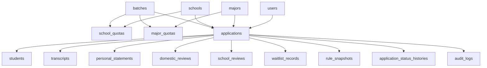

# 同学 D：数据库结构理解与汇报稿

这份稿子是给你直接准备汇报用的。你的任务不是讲“所有业务怎么跑”，而是讲清楚：

1. 这套系统数据库为什么要这样分层
2. 主要有哪些核心表
3. 表和表之间怎么关联
4. 这样设计的好处是什么

你的定位可以理解成：**讲数据库骨架的人**。  
同学 E 负责接着你往后讲“数据怎么流、状态怎么变、每一步写了什么表”。

---

## 一、你负责讲什么

### 你的分工

- 讲数据库整体结构
- 讲核心表分类
- 讲主外键关系和模块边界
- 讲为什么不是一张大表全塞进去
- 讲这样设计如何支持后面的审核、候补、调剂、日志追踪

### 你不要展开太多的部分

- 不要把每个接口一条条念完
- 不要详细讲每一个状态怎么变
- 不要抢同学 E 的“流程流转”内容

一句话说清楚你的范围：

> 我主要汇报数据库怎么搭起来，数据分别放在哪些表里，以及这些表为什么这样设计。

---

## 二、你开场可以直接这样讲

> 我们这套留学申请与审核系统，在数据库层没有采用“一张申请大表塞全部信息”的做法，而是按业务职责拆成了基础配置、申请主体、审核过程、候补调剂、日志追踪几大类。这样做的原因是：第一，数据职责清晰；第二，便于多人并行开发；第三，后期更容易追踪申请状态和排查问题。

这句说完，老师一般就知道你不是在背表名，而是在讲设计思路。

---

## 三、数据库整体结构怎么理解

你可以把整个数据库理解成 5 层：

| 层次 | 主要作用 | 代表表 |
| --- | --- | --- |
| 基础配置层 | 存系统运行必须的基础数据 | `users`、`batches`、`schools`、`majors`、`school_quotas`、`major_quotas` |
| 申请主体层 | 存一条申请本身和学生资料 | `applications`、`students`、`transcripts`、`personal_statements` |
| 审核过程层 | 存国内审核和学校审核结果 | `domestic_reviews`、`school_reviews` |
| 衍生流程层 | 存候补、调剂等特殊流程信息 | `waitlist_records`、`rule_snapshots` |
| 追踪留痕层 | 存状态变化和操作审计 | `application_status_histories`、`audit_logs` |

你讲的时候重点要强调：

- **基础配置层**决定系统能不能正常运行
- **申请主体层**是主业务数据
- **审核过程层**不是覆盖主表，而是保留独立审核记录
- **追踪留痕层**保证每次变化都有痕迹

---

## 四、最核心的 10 张表，你必须讲懂

下面这些表，不需要逐字段背诵，但一定要知道它们分别管什么。

### 1. `users`

作用：存系统登录账号和角色。

你要会说：

- 谁能登录系统，先看 `users`
- 角色在这里区分，比如管理员、代理专员、国内审核员、学校专员
- 学校专员账号还会带 `school_code`，用于限制只能看本校申请

### 2. `batches`

作用：存招生批次。

你要会说：

- 整个系统很多数据都要挂在某一个批次下
- 批次像“总线”，把申请、配额、学校名额这些数据串起来

### 3. `schools`

作用：存学校基础信息。

### 4. `majors`

作用：存专业基础信息，并且专业和学校是关联的。

这两个表一起讲就行：

- 学校和专业是静态配置
- 申请不是自由输入学校和专业，而是引用这两张基础表

### 5. `school_quotas`

作用：存某批次下学校级配额。

### 6. `major_quotas`

作用：存某批次下专业级配额。

讲法：

- 配额不是写在学校表或专业表里，而是拆出来单独管
- 因为配额跟批次绑定，而且学校总配额和专业配额不是一个粒度

### 7. `students`

作用：存学生个人资料。

讲法：

- 学生姓名、性别、联系方式、身份证号等放在这里
- 不直接塞进 `applications`，是为了让申请主表保持聚焦

### 8. `applications`

作用：整个系统最核心的主表。

你要重点讲这张表：

- 一条申请对应一个申请编号
- 它记录目标学校、目标专业、所属批次、创建人、当前状态
- 它像整个系统的“主线索引”，很多其他表都围着它转

### 9. `domestic_reviews`

作用：存国内审核记录。

### 10. `school_reviews`

作用：存学校审核记录。

讲法：

- 审核结果不直接写死在 `applications` 的一堆字段里
- 而是保留独立审核记录，这样既能看结论，也能追溯审核细节

---

## 五、数据库关系图怎么讲

你汇报时可以直接照着下面这个图讲。

你可以配一句解释：

> 从关系上看，`applications` 是中心主表，学生资料、成绩、审核、候补、日志都围绕它展开；而批次、学校、专业、配额这些表属于它的基础约束条件。

---

## 六、为什么不能只用一张申请大表

老师如果问“为什么不把所有字段都放在 applications 表里”，你就答这段：

### 原因 1：职责会混乱

- 申请主体信息、审核结果、候补记录、审计日志本来就不是一类数据
- 放在一张表里，字段会越来越多、越来越乱

### 原因 2：不好维护

- 后续加字段、改规则、排查问题都很困难
- 一张表承担太多职责，修改一个地方容易影响别的模块

### 原因 3：不利于追踪过程

- 审核不是只有最终结果，还需要保留审核动作和历史
- 如果直接覆盖写，就看不出中间发生了什么

### 原因 4：不利于多人协作

- 这个项目本来就有不同同学分别负责代理端、国内审核、学校审核
- 数据表拆清楚以后，大家各自接自己那一部分，不容易冲突

---

## 七、你要特别强调的设计亮点

这部分是汇报加分项，建议你一定讲。

### 亮点 1：`applications` 只保留主业务状态，不吞掉所有细节

这说明数据库是“主表 + 子表”的设计，而不是把所有信息堆一起。

### 亮点 2：审核记录独立建表

`domestic_reviews` 和 `school_reviews` 独立存在，意味着：

- 可以保留审核细节
- 可以做过程回放
- 可以支持后续扩展统计

### 亮点 3：日志和状态历史分开

这里一定要区分：

- `application_status_histories`：记录状态怎么变
- `audit_logs`：记录是谁、什么时候、做了什么操作

也就是说：

- 一个偏“状态轨迹”
- 一个偏“操作留痕”

### 亮点 4：配额独立建模

不是简单存一个“剩余名额”，而是学校和专业两级配额拆开管理，后续学校审核时可以单独做判断。

---

## 八、你最后 2 分钟可以这样总结

> 总结一下，我们数据库的核心设计思想是：以 `applications` 为主表，以学生资料、审核记录、候补记录、日志记录为子表，以批次、学校、专业、配额为基础配置约束。这样做的好处是结构清晰、流程可追踪、便于多人协作，也能支持后面复杂的状态流转和审核判断。

---

## 九、老师可能追问什么，你怎么答

### 追问 1：哪张表最核心？

答：

> 最核心的是 `applications`，因为它串起了目标学校、专业、批次、创建人和当前状态，其他很多表都是围绕它展开的。

### 追问 2：为什么审核不直接改申请表？

答：

> 申请表会更新当前状态，但审核细节不能只留在申请表里，否则无法追溯审核内容，所以国内审核和学校审核都保留独立记录表。

### 追问 3：为什么日志要两套？

答：

> 因为状态历史和操作审计关注点不同。状态历史看的是“申请从什么状态到什么状态”，审计日志看的是“谁在什么时候做了什么动作”。

### 追问 4：数据库设计怎么支撑后面复杂流程？

答：

> 关键是把主表、审核表、候补表、日志表拆开。这样每个阶段都能写自己的记录，同时又统一挂到 applicationId 上，前端详情页就能把这些信息聚合展示出来。

---

## 十、你汇报时最稳的节奏

建议你按这个顺序讲：

1. 先讲整体分层
2. 再讲核心主表 `applications`
3. 再讲学生、审核、候补、日志这些子表
4. 再讲基础配置表和配额表
5. 最后讲为什么这样设计

这样最清楚，也最像你真的理解了数据库。

---

## 十一、给你的最简版提词卡

如果你上台紧张，就盯着这 6 句说：

1. 这套数据库不是一张大表，而是按职责拆成几层。
2. `applications` 是主表，串起整条申请主线。
3. `students`、`transcripts`、`personal_statements` 负责申请内容本身。
4. `domestic_reviews`、`school_reviews` 负责审核过程，不直接覆盖主表细节。
5. `waitlist_records`、`application_status_histories`、`audit_logs` 负责特殊流程和留痕。
6. 这样设计的好处是结构清晰、流程可追踪、协作不冲突。

---

## 十二、你和同学 E 的衔接话术

你讲完可以这样交给 E：

> 我刚才主要讲的是数据库怎么搭、表和表怎么关联。接下来同学 E 会继续讲，这些表在真实业务里是怎么被写入和读取的，也就是一条申请从创建到审核、候补、调剂的过程中，数据到底怎么流动。

