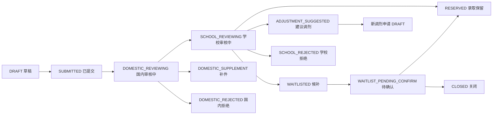

# 同学 E：数据库数据流与状态流汇报稿

这份稿子给你的目标很明确：**把“数据怎么回事”讲明白。**

如果说同学 D 讲的是“数据库长什么样”，那你讲的就是：

1. 一条申请从创建到结束，数据怎么流
2. 每一步会写哪些表
3. 状态为什么变化
4. 前端点一个按钮，数据库里到底发生了什么

你可以把自己理解成：**讲业务流和数据流的人。**

---

## 一、你的分工

### 你负责讲

- 一条申请的完整生命周期
- 代理、国内审核、学校审核、候补、调剂分别怎么写库
- 状态是如何一步一步推进的
- 为什么前端一个动作，后端不只是改一列状态

### 你不用讲太深的

- 不用把所有表结构从头定义一遍
- 不用抢同学 D 的“为什么这么设计数据库”
- 不用逐字段背所有 SQL

你开场直接说：

> 我主要汇报一条申请在系统里是怎么流动的，也就是前端每做一步操作，数据库里会新增或更新什么数据，以及申请状态是怎么变化的。

---

## 二、先讲最核心的思路

你一定要先把这句讲出来：

> 这套系统的核心不是“填完表单就结束”，而是围绕 `applicationId` 形成一条业务主线。随着代理提交、国内审核、学校审核、候补和调剂，数据库会不断写入新的过程数据，同时推动 `applications.current_status` 向后流转。

这句一出来，后面全顺了。

---

## 三、整条流程一共分几步

你就按这 6 步讲：

| 阶段 | 主要角色 | 前端动作 | 主要写入/更新的表 | 结果状态 |
| --- | --- | --- | --- | --- |
| 1 | 代理专员 | 创建草稿 | `applications`、`students`、`transcripts`、`personal_statements` | `DRAFT` |
| 2 | 代理专员 | 正式提交 | `applications`、`application_status_histories`、`audit_logs` | `SUBMITTED` |
| 3 | 国内审核员 | 认领并提交审核 | `domestic_reviews`、`applications`、`application_status_histories`、`audit_logs` | `SCHOOL_REVIEWING` / `DOMESTIC_SUPPLEMENT` / `DOMESTIC_REJECTED` |
| 4 | 学校专员 | 学校审核 | `school_reviews`、`applications`、配额相关表、状态历史、审计日志 | `RESERVED` / `WAITLISTED` / `ADJUSTMENT_SUGGESTED` / `SCHOOL_REJECTED` |
| 5 | 代理/系统 | 候补确认或处理调剂 | `waitlist_records`、`applications`、状态历史、审计日志 | `WAITLIST_PENDING_CONFIRM` / `RESERVED` / `CLOSED` / 新 `DRAFT` |
| 6 | 全流程收尾 | 查看轨迹 | `application_status_histories`、`audit_logs` 被持续累积 | 形成完整留痕 |

---

## 四、用一条申请来讲，最容易懂

你可以直接把一条申请理解成下面这条主线：

你讲的时候强调：

- 状态流是整个系统的主线
- 每一步都不是“只改状态”，而是状态和过程数据一起写

---

## 五、每一步数据库到底发生了什么

这部分是你汇报最核心的内容。

### 第一步：代理创建申请草稿

前端动作：

- 代理专员进入创建申请页
- 填学生信息、成绩信息、个人陈述、目标学校、目标专业
- 点击保存草稿

涉及数据：

| 数据块 | 典型字段 |
| --- | --- |
| 学生信息 | `name`、`gender`、`birthDate`、`currentSchool`、`grade`、`email`、`phone`、`idCardNo` |
| 成绩信息 | `averageScore`、`failedSubjectCount`、各科成绩、`fileId` |
| 申请主体 | `batchId`、`targetSchoolCode`、`targetMajorCode` |
| 文书信息 | `personalStatement.content` |

主要写表：

- `applications`
- `students`
- `transcripts`
- `personal_statements`

结果：

- `applications.current_status = DRAFT`

你可以这样讲：

> 这一阶段数据库主要做的是把申请骨架和资料内容建起来，所以会同时写主表和几个资料子表。此时申请还没有进入审核，只是草稿状态。

---

### 第二步：代理正式提交申请

前端动作：

- 在申请详情页或列表页点击“提交申请”

主要变化：

- `applications.current_status` 从 `DRAFT` 变成 `SUBMITTED`
- 新增状态历史记录
- 新增操作审计日志

主要写表：

- `applications`
- `application_status_histories`
- `audit_logs`

你要重点说：

> 这里不是简单把状态从草稿改成已提交，还会同时记录状态变化轨迹和操作日志，这样后面可以追溯是谁提交的、什么时候提交的。

---

### 第三步：国内审核员认领

前端动作：

- 国内审核员在审核列表页打开申请
- 点击“认领审核”

判定条件：

- 只有 `SUBMITTED` 的申请才能被认领

数据库变化：

- `applications.current_status` 变成 `DOMESTIC_REVIEWING`
- 记录状态历史
- 记录审计日志

为什么这么设计：

- 表示这条申请已经被国内审核环节接管
- 后面才能提交国内审核结论

---

### 第四步：国内审核提交结论

前端动作：

- 填写审核表单
- 典型字段有：
  - `materialComplete`
  - `identityMatched`
  - `basicScorePassed`
  - `authenticityRiskLevel`
  - `standardizationPassed`
  - `result`
  - `comment`

主要写表：

- `domestic_reviews`
- `applications`
- `application_status_histories`
- `audit_logs`

状态分三种：

| 审核结果 | 含义 | 状态变化 |
| --- | --- | --- |
| `PASS` | 国内审核通过 | `DOMESTIC_REVIEWING -> SCHOOL_REVIEWING` |
| `SUPPLEMENT_REQUIRED` | 要求补件 | `DOMESTIC_REVIEWING -> DOMESTIC_SUPPLEMENT` |
| `REJECT` | 国内拒绝 | `DOMESTIC_REVIEWING -> DOMESTIC_REJECTED` |

你汇报时一定要说这句：

> 国内审核这一步，数据库里新增的是一条审核记录，同时更新申请当前状态。也就是说，审核“过程数据”和申请“当前状态”是同时维护的。

---

### 第五步：补件流程

如果国内审核结果是补件：

- 前端会回到代理专员
- 代理补充资料后重新提交

数据库上怎么理解：

- 原申请不会新建一条新的主申请
- 而是在原申请链路上继续补充资料
- 提交后重新回到 `SUBMITTED`

主要写表：

- `students` / `transcripts` / `personal_statements` 可能被补充更新
- `applications.current_status`
- `application_status_histories`
- `audit_logs`

讲法：

> 补件不是重新开始，而是在原申请上继续补资料并重新进入审核池。

---

### 第六步：学校审核

当前提是：申请已经进入 `SCHOOL_REVIEWING`。

前端动作：

- 学校专员打开学校审核详情页
- 填评分、填结论

典型数据：

- `school_threshold_passed`
- `major_threshold_passed`
- `school_quota_passed`
- `major_quota_passed`
- `academic_score`
- `material_score`
- `matching_score`
- `total_score`
- `review_result`
- `review_reason`
- `suggested_major_code`

主要写表：

- `school_reviews`
- `applications`
- `application_status_histories`
- `audit_logs`
- 配额相关表会被读取，部分场景会联动

结果分四种：

| 学校结论 | 数据库含义 | 状态结果 |
| --- | --- | --- |
| `RESERVE` | 学校录取 | `RESERVED` |
| `WAITLIST` | 进入候补 | `WAITLISTED` |
| `SUGGEST_ADJUSTMENT` | 建议调剂 | 原申请调剂建议后关闭，同时生成新调剂草稿 |
| `REJECT` | 学校拒绝 | `SCHOOL_REJECTED` |

你可以这样讲：

> 学校审核是最复杂的一步，因为它不仅要写学校审核记录，还要结合学校和专业配额、匹配度、评分结果决定最后分流到录取、候补、调剂还是拒绝。

---

### 第七步：候补流程

如果学校审核结果是 `WAITLISTED`，就进入候补链。

候补不是一句话，要分两步讲：

#### 1）候补推进

- `WAITLISTED -> WAITLIST_PENDING_CONFIRM`
- 会写/更新 `waitlist_records`

#### 2）候补确认

- 如果接受：`WAITLIST_PENDING_CONFIRM -> RESERVED`
- 如果拒绝或失效：`WAITLIST_PENDING_CONFIRM -> CLOSED`

涉及表：

- `waitlist_records`
- `applications`
- `application_status_histories`
- `audit_logs`

你汇报时要强调：

> 候补本身不是一个状态就结束，它是一个独立子流程，所以系统专门有 `waitlist_records` 这张表来记录候补信息。

---

### 第八步：调剂流程

如果学校审核结果是 `SUGGEST_ADJUSTMENT`：

- 原申请先被标记为调剂建议
- 随后原申请关闭
- 系统生成一条新的调剂申请草稿

这个点很重要，你一定要讲清：

> 调剂不是直接改原申请的目标专业，而是生成一条新的调剂申请。这样原申请链路和新调剂链路都能保留，方便追溯。

涉及表：

- `applications`（原申请和新申请都会变化）
- `application_status_histories`
- `audit_logs`
- `rule_snapshots` 也可能用于记录当时规则上下文

---

## 六、为什么前端一个按钮，数据库却会改多张表

这部分老师很可能会喜欢，你要稳稳讲出来。

### 原因 1：主状态要更新

- 比如从 `SUBMITTED` 变成 `DOMESTIC_REVIEWING`

### 原因 2：过程记录要保留

- 审核结论不能只留下最终状态
- 还要有国内审核记录、学校审核记录

### 原因 3：轨迹要可追溯

- `application_status_histories` 记录状态变化
- `audit_logs` 记录是谁做了什么

### 原因 4：特殊流程有自己的数据

- 候补有 `waitlist_records`
- 调剂会衍生新申请

一句话概括：

> 所以前端点一个按钮，数据库通常不是改一个字段，而是“主表状态 + 过程记录 + 日志留痕”一起更新。

---

## 七、你汇报时最值得讲的亮点

### 亮点 1：系统是围绕 `applicationId` 做全流程串联

一条申请从草稿到关闭，不会断线。

### 亮点 2：状态流转和审核内容是分开的

- `applications.current_status` 管当前在哪一步
- `domestic_reviews` / `school_reviews` 管审核细节

### 亮点 3：候补和调剂不是补丁，而是单独建模

这说明数据库不是只考虑普通成功路径，也考虑了复杂业务分支。

### 亮点 4：日志设计让问题可排查

这点非常适合老师问“出了 bug 怎么查”的时候回答。

---

## 八、你最后可以这样总结

> 总结来说，这套数据库不是静态存资料，而是动态支撑整条申请业务链。代理创建申请时建立主数据，国内审核和学校审核分别写入自己的审核记录，候补和调剂再进入分支流程，同时所有关键动作都配有状态历史和审计日志，因此整个申请从创建到结束都是可追踪、可回放的。

---

## 九、你最容易被问到的 4 个问题

### 1. 为什么提交审核不只是改状态？

答：

> 因为除了状态变化，还要保存审核内容本身。比如国内审核的材料完整性、身份匹配、风险等级，学校审核的评分和结论，都必须独立保存。

### 2. 为什么候补单独建表？

答：

> 因为候补不仅有状态，还有确认截止时间、候补处理过程等信息，和普通申请字段不是一类，所以要用独立的 `waitlist_records` 来承载。

### 3. 调剂为什么要新建申请？

答：

> 直接改原申请会破坏原始轨迹。生成一条新的调剂草稿，原申请关闭，能把前后两条链路都保留下来。

### 4. 怎么知道是谁改了数据？

答：

> 通过 `audit_logs` 查操作人、操作时间和动作类型，通过 `application_status_histories` 查状态从哪里变到哪里。

---

## 十、你和同学 D 的衔接

### 如果你在 D 后面讲

你开头就说：

> 刚才同学 D 主要介绍了数据库怎么分层、表和表怎么关联。接下来我继续讲这些表在真实业务里是怎么一起工作的，也就是一条申请从创建到结束时，数据到底怎么流。

### 你结束时可以这样收

> 所以从数据库角度看，这个系统最核心的不是“存了一堆表”，而是这些表能围绕申请主线一起工作，把申请、审核、候补、调剂和日志串成一套完整链路。

